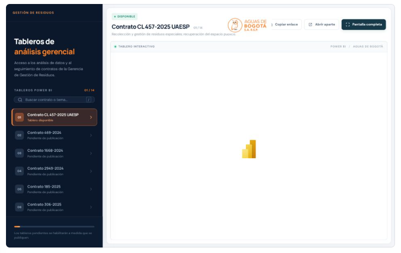

# Tableros de Gestión de Residuos

Proyecto de análisis de datos de la **Gerencia de Gestión de Residuos de Aguas de Bogotá**. Este portal reúne los tableros de Power BI asociados a sus contratos para que la gerencia consulte los análisis y el seguimiento de cada uno desde un solo lugar. Cada tablero mantiene su propio modelo de datos; el sitio centraliza el acceso y permite verlo en pantalla completa.

Al abrir el portal o cambiar de contrato, una pantalla de carga con el emblema institucional acompaña la transición hasta que el visor responde. Si Power BI tarda demasiado, el portal libera la vista automáticamente.

La navegación entre páginas **dentro** de un tablero público de Power BI ocurre en su `iframe` y no emite eventos al portal. Para mostrar este cargador también en esas páginas internas haría falta una integración mediante la API de inserción de Power BI.



## Estado del catálogo

El portal tiene 14 espacios previstos. El documento «CONTRATOS MACROS VIGENTES» permitió identificar 12 contratos. El tablero del contrato **CL 457-2025 UAESP** ya tiene un enlace de Power BI; los demás se muestran como pendientes hasta recibir sus enlaces. Los espacios 13 y 14 permanecen provisionales.

## Abrir y actualizar

Abre `index.html` en un navegador. Para publicar el portal, sirve toda esta carpeta desde un alojamiento estático con HTTPS.

Los contratos se administran en `data/reports.js`. Cada línea indica el número del espacio, el nombre del contrato y el enlace de Power BI. Para activar el segundo tablero, por ejemplo, cambia su línea por:

```js
contrato(2, 'Contrato 469-2024', 'https://app.powerbi.com/view?r=ENLACE_REAL', 'Limpieza y mantenimiento de predios.'),
```

Conserva el número del espacio. Si el enlace aún no está disponible, deja `''` en el tercer valor y el portal mostrará «Pendiente». Guarda el archivo y recarga la página.

## Estructura

```text
index.html                    Interfaz del portal
assets/styles.css             Diseño adaptable a escritorio y móvil
assets/app.js                 Menú, búsqueda, visor y pantalla completa
assets/vista-general-portal.png Captura incluida en este README
data/reports.js               Catálogo de contratos y enlaces
```

El enlace del primer tablero usa la modalidad pública de Power BI. Antes de publicar otros tableros con información interna, verifica que su configuración de acceso sea la adecuada.
